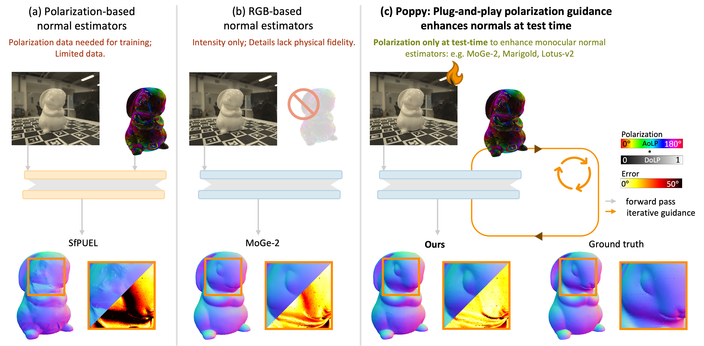

# Poppy: Polarization-based Plug-and-Play Guidance for Enhancing Monocular Normal Estimation (ECCV 2026 Oral)

[Irene Kim](https://irnkim.github.io), [Sai Tanmay Reddy Chakkera](https://starc52.net), [Alexandros Graikos](https://alexgraikos.github.io/), [Dimitris Samaras](https://www3.cs.stonybrook.edu/~samaras/), [Akshat Dave](https://akshatdave.github.io/)  
Stony Brook University

[](https://irnkim.github.io/poppy/) [](https://irnkim.github.io/poppy/) [](https://arxiv.org/abs/2603.27891)

---

Poppy is a training-free framework that refines surface normals from any frozen RGB monocular normal estimator using single-shot polarization measurements at test time. Given four polarization images (0°, 45°, 90°, 135°), it optimizes learnable per-pixel offsets by minimizing a physics-based polarization consistency loss (Stokes vector matching via Fresnel equations), without modifying backbone weights.



---


## Dependencies

- Python ≥ 3.9
- PyTorch ≥ 2.0 with CUDA
- [Marigold](https://github.com/prs-eth/marigold) (`diffusers`, `transformers`)
- [MoGe-2](https://github.com/microsoft/MoGe) (`moge`)
- [Lotus-2](https://github.com/EnVision-Research/Lotus-2) (`diffusers`, `peft`)
- `imageio`, `Pillow`

---

## Data Format

The data directory must follow this structure:

```
data_dir/
├── pol000/   # 0° polarization images (.png)
├── pol045/   # 45° polarization images (.png)
├── pol090/   # 90° polarization images (.png)
├── pol135/   # 135° polarization images (.png)
├── mask/     # Binary masks (.png)
└── normal/   # Ground-truth normals (.png, optional)
```

---

## Usage

We evaluate Poppy on three backbones presented in the paper: MoGe-2, Marigold, and Lotus-2. MoGe-2 and Marigold are run via `run.py`; Lotus-2 has its own entry point `run_lotus2.py` due to its multi-stage pipeline.

### MoGe-2

```bash
python run.py --backbone moge2 --gpu 0 \
  --data [path] --output [path] \
  --num_opt 100 \
  --image_lr 1e-5 --fs_lr 1e-2 --normal_lr 1e-3
```

### Marigold

```bash
python run.py --backbone marigold --gpu 0 \
  --data [path] --output [path] \
  --num_opt 25 --num_inf 4 \
  --image_lr 1e-3 --fs_lr 1e-2 --normal_lr 1e-3
```

### Lotus-2

```bash
python run_lotus2.py --backbone lotus2 --gpu 0 \
  --data [path] --output [path] \
  --num_opt 100 --num_inf 10 \
  --image_lr 5e-4 --fs_lr 1e-2 --normal_lr 1e-3
```

Lotus-2 model weights are auto-downloaded from [jingheya/Lotus-2](https://huggingface.co/jingheya/Lotus-2) if paths are not provided.

Output is written to `--output` (defaults to `<data>/output`) for all entry points:
- `vis/<name>.png` — color-coded normal map visualization
- `vis/<name>_Ls.png`, `vis/<name>_Ld.png` — recovered specular / diffuse intensity visualizations
- `outputs/<name>.npz` — predicted normals and recovered specular/diffuse intensity as numpy arrays (`normals`, `Ls`, `Ld` keys)
- `log.csv` — per-image optimization time (`time_sec`, wall-clock seconds for the num_opt optimization steps) and angular error metrics (mean, median, RMSE, acc@11.25°/22.5°/30°, blank if no ground-truth normals are available)

---

## Citation

```bibtex
@article{kim2026poppy,
  title={Poppy: Polarization-based Plug-and-Play Guidance for Enhancing Monocular Normal Estimation},
  author={Kim, Irene and Chakkera, Sai Tanmay Reddy and Graikos, Alexandros and Samaras, Dimitris and Dave, Akshat},
  journal={arXiv preprint arXiv:2603.27891},
  year={2026}
}
```

---

## Acknowledgements

- `guidance/lotus2_guidance.py`, `run_lotus2.py`, and `utils/image_utils.py` / `utils/seed_all.py` / `utils/visualize.py` are adapted from or copied from [Lotus-2](https://github.com/EnVision-Research/Lotus-2) (He et al.).
